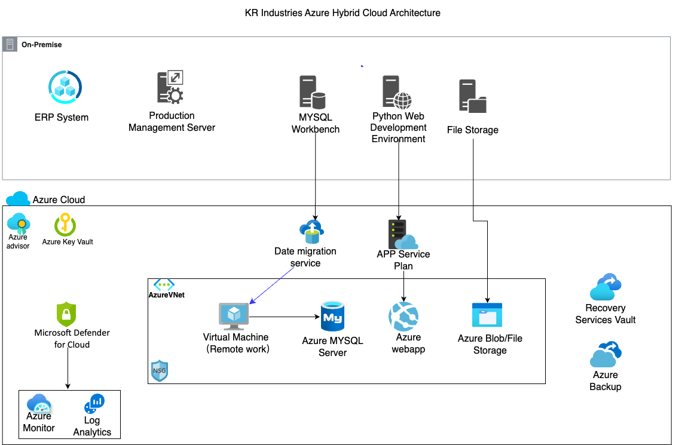
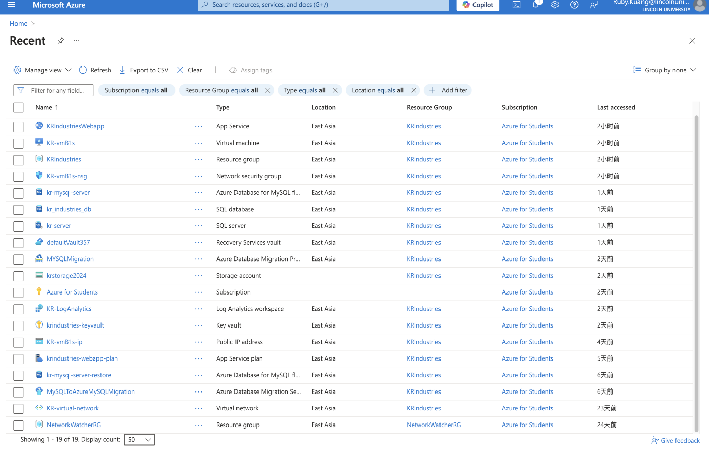
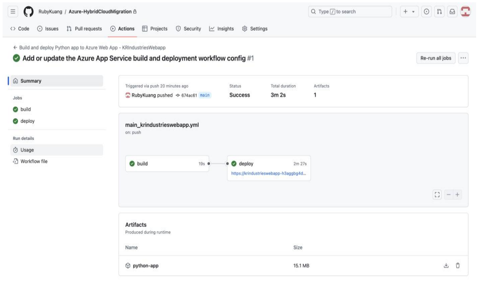
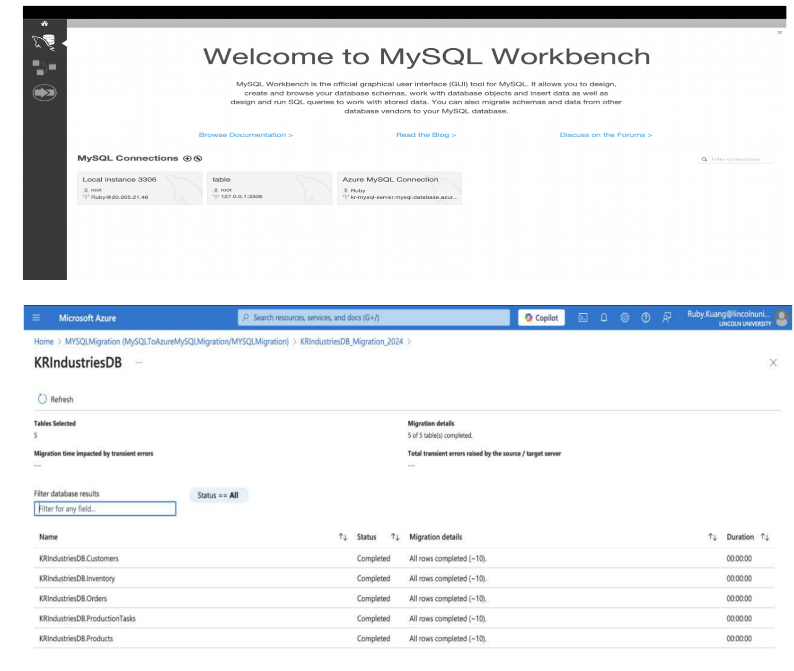
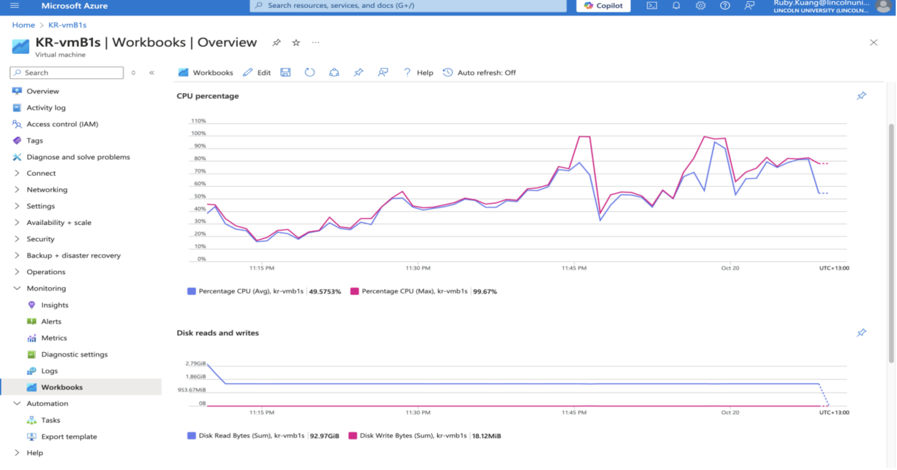
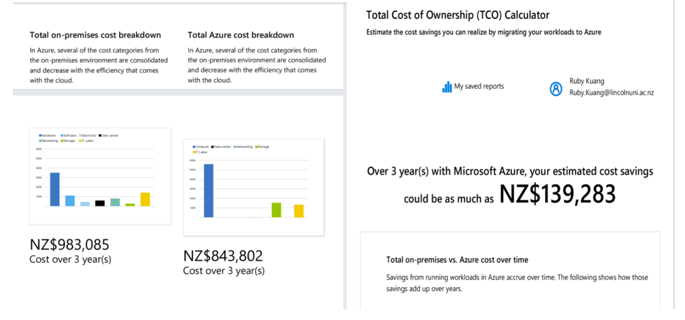

# Azure Hybrid Cloud Migration

## Project Overview

This project demonstrates a hybrid cloud migration workflow using Microsoft Azure services. A Flask-based web application and MySQL database were migrated from a local development environment to Azure cloud infrastructure.

The project includes application deployment, database migration, cloud storage, monitoring, backup, and security configuration within a hybrid cloud architecture.

---

## Technologies Used

- Microsoft Azure
- Azure App Service
- Azure Database for MySQL
- Azure Virtual Machine
- Azure Blob Storage
- Azure Backup
- Azure Monitor
- Azure Advisor
- Microsoft Defender for Cloud
- Network Security Group (NSG)
- GitHub Actions
- Python Flask
- MySQL Workbench

---

## Hybrid Cloud Architecture

The solution follows a hybrid cloud architecture where selected workloads are migrated to Azure cloud services while maintaining an on-premise style environment for specific systems.

---

## Key Features

- Designed a hybrid cloud migration architecture
- Deployed a Flask web application to Azure App Service
- Automated deployment using GitHub Actions CI/CD
- Migrated MySQL database to Azure Database for MySQL
- Configured SSH tunnel access for secure database management
- Uploaded and managed files using Azure Blob Storage
- Implemented basic security configuration using NSG
- Configured Azure Backup and restore points
- Monitored CPU, disk, network, and memory utilisation
- Completed Azure TCO and cost analysis

---

## Deployment Workflow

1. Develop Flask application locally
2. Push source code to GitHub repository
3. Trigger GitHub Actions workflow
4. Deploy application to Azure App Service
5. Connect Azure Web App to Azure MySQL database
6. Validate application and database functionality

---

## Azure Services Overview

Azure resource group containing the virtual machine, Azure MySQL database, storage account, and Azure Web App services.

---

## GitHub Actions Deployment

GitHub Actions workflow used for automated deployment to Azure App Service.

---

## Database Migration

Migration and secure management of Azure MySQL database using SSH tunnelling and MySQL Workbench.

---

## Monitoring and Performance Metrics

Azure Monitor dashboard showing CPU, disk, network, and memory utilisation metrics.

---

## Cost Analysis

Azure Total Cost of Ownership (TCO) analysis comparing estimated on-premises infrastructure costs with Azure cloud migration costs over a three-year period.

---

## Documentation

- [Project Summary](docs/project-summary.md)

---

## Notes

This repository is intended as a portfolio demonstration of Azure hybrid cloud migration concepts, including cloud deployment, CI/CD automation, monitoring, backup, and basic security configuration.
